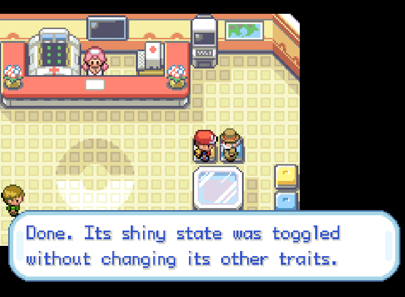
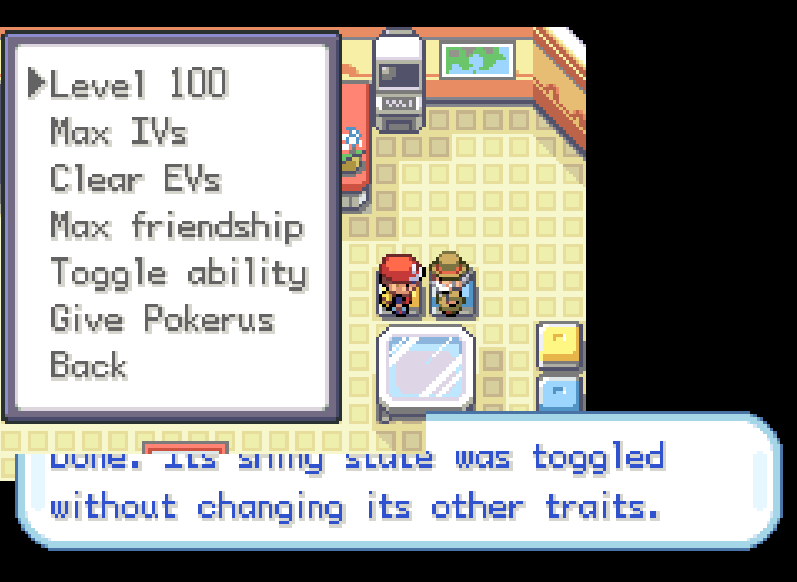
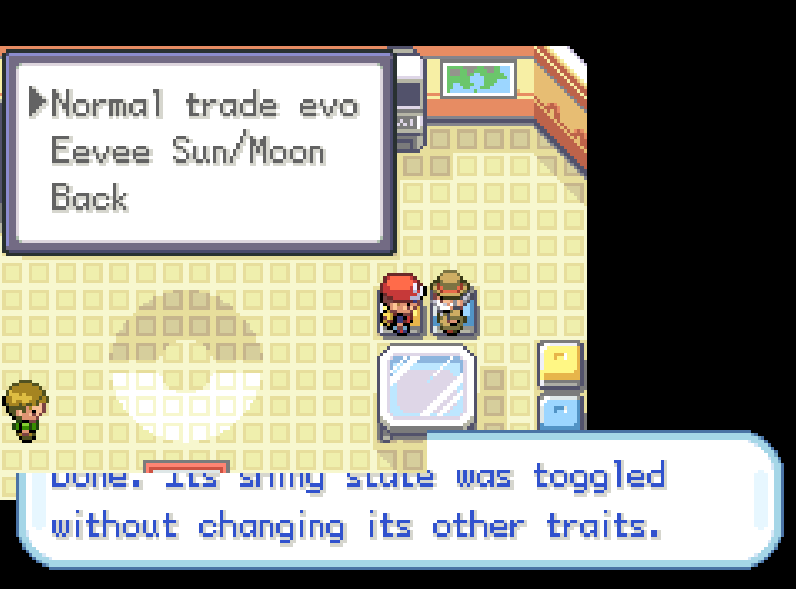
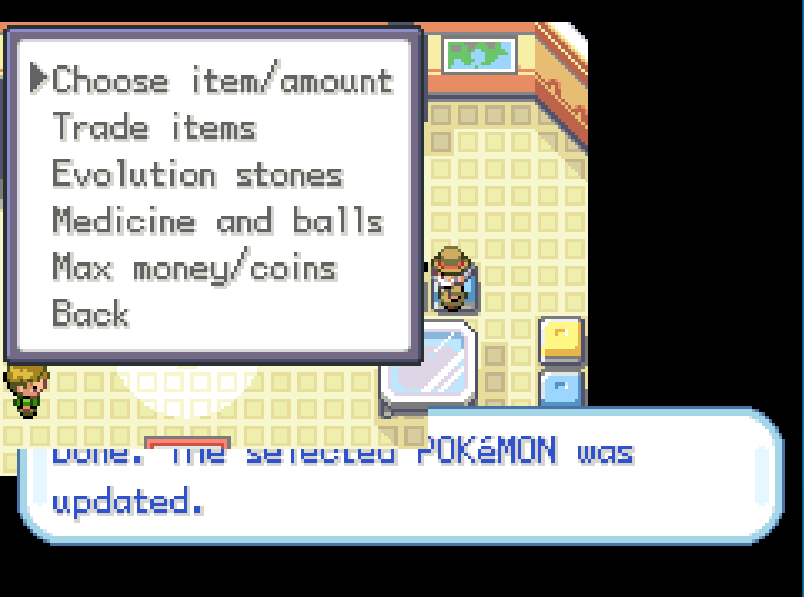
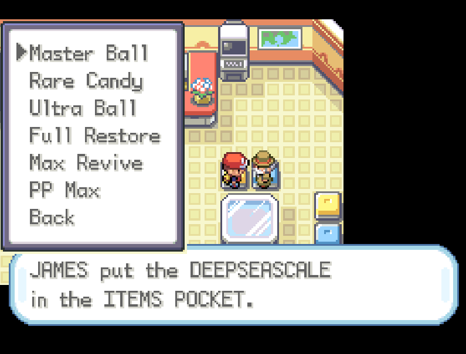
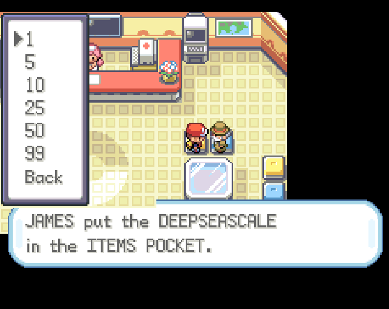
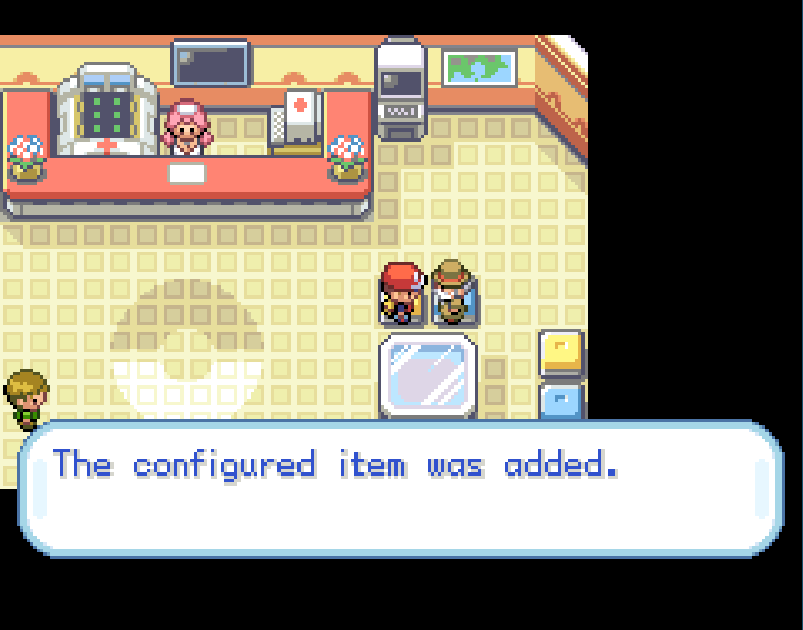
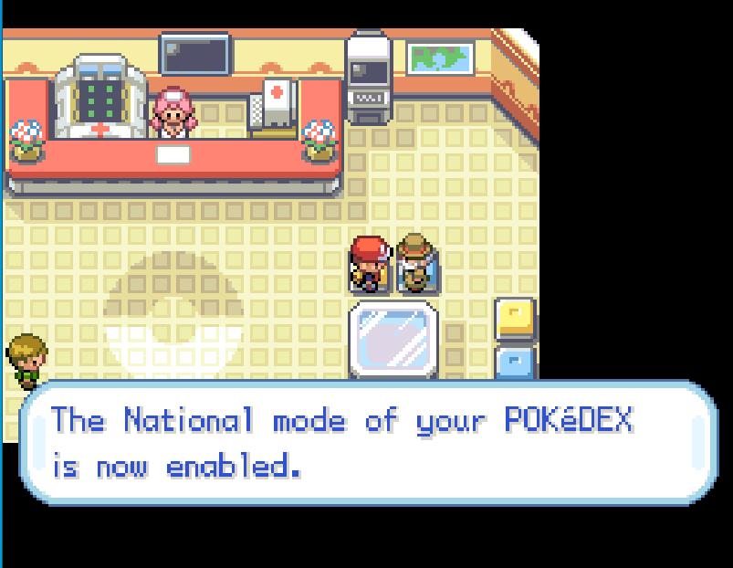
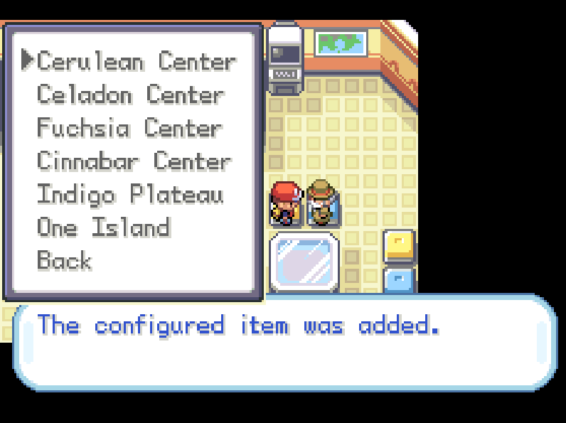

Applies a native utility expansion to English Pokémon FireRed and LeafGreen ROMs. The transformation runs locally inside the browser to produe an ordinary GBA executable with the additional service code compiled into the game. The patch repurposes the old guy inside Viridian Citys Pokémon Center as its entry point. Talking to him opens a dialouge for Pokémon editing, evolution, item creation, progression changes, encounter resets and map travel. Once patched none of this depends on corrupt Mail, species 0x0351, PC box name payloads, a BIOS ACE return path or emulator pecific code injection

## Supported revisions

| Game | Revision | Original SHA-1 | Verified patched base SHA-1 | Configuration offset |
| --- | --- | --- | --- | --- |
| FireRed | English 1.0 | 41cb23d8dccc8ebd7c649cd8fbb58eeace6e2fdc | f6dafb41ce91ad396f56ff948ac6c29450c00998 | 0xEB26B8 |
| FireRed | English 1.1 | dd5945db9b930750cb39d00c84da8571feebf417 | 44908e8c5223dd73f8cc2868223511012c285506 | 0xEB26B8 |
| LeafGreen | English 1.0 | 574fa542ffebb14be69902d1d36f1ec0a4afd71e | d26b4bb82e12ecb1f7a155a6869d4ccc4ea7bf3f | 0xEB29B0 |
| LeafGreen | English 1.1 | 7862c67bdecbe21d1d69ce082ce34327e1c6ed5e | 89a66b36f4bb5f6eed6badfda119af1f2d2024de | 0xEB29B0 |

Other languages, revisions, translations, randomisers and existing ROM hacks wont pass identification because their compiled addresses arent guaranteed to match these targets.

## Example(s)

The training submenu groups the higher level party mutations separately from identity editing, evolution, cloning and removal operations

Evolution handling uses native evolution logic rather than replacing the Pokémon directly with another species. Normal trade evolution runs through the games evolution sequence while the added Sun Stone/Moon Stone routes provide deterministic Espeon and Umbreon alternatives for Eevee

Item creation also remains an in game decision. The browser doesnt bake a particular item identifier or quantity into the patch because the old guy exposes category, item, and amount menus at runtime

The medicine and battle item submenu provides fixed useful selections through the same inventory insertion path used by the wider item service

Quantity selection is handled after choosing the item keeping the generated ROM reusable instead of tying it to one predefined amount

After validating the selected item and amount the native routine adds the configured result to the appropriate inventory pocket and reports completion through normal dialogue

Progression services update the same flags and state fields used by the original scripts. National Pokédex activation therefore behaves as persistent game state rather than a temporary interface override

Travel destinations use normal map transitions and configured warp targets, so map loading, music, object events and arrival positions remain under the games existing field engine

## Service entry point

The existing old guy remains on the original map and retains his normal interaction geometry. Reusing that object avoids adding another event slot, changing collision or moving standard Pokémon Center objects

